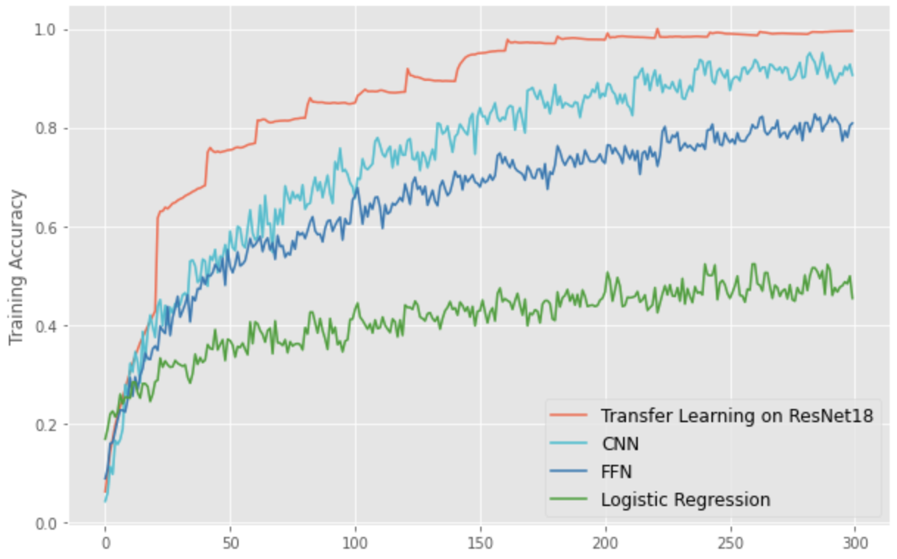
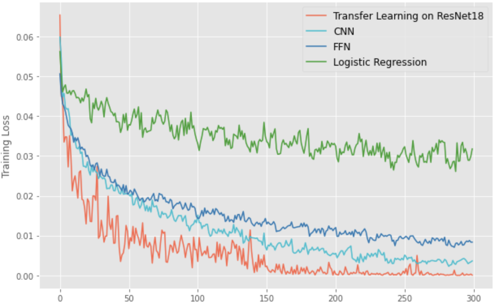

# Object Detection on LEGO images

## Video Demo
* https://youtu.be/WZs-iwlfsUE

## Overview of Work Accomplished
### Sub-Task - 50 Classes LEGO Single Bricks Classification
* Use Logistic Regression, Simple Feed Forward Neural Networks, CNN, Transfer Learning on ResNet-18

| Models | Accuracy | Loss |
| ------------- | :-------------: | :-------------: |
| Logistic Regression | 0.3304 | 0.0318 |
| Feed Forward Neural Networks | 0.6646 | 0.0084 |
| CNN | 0.7084 | 0.0031 |
| Transfer Learning on ResNet18 | 0.9647 | 0.0015 |

Training Accuracy             |  Training Loss
:-------------------------:|:-------------------------:
  |  

### Object Detection Task - Bricks Detection on Composite LEGO models
* Use Tiny-YOLO-v3 model to detect brick category in composite Lego and label them with corresponding bounding box.
* Use YOLO v3 model to detect brick category in composite Lego and label them with corresponding bounding box.

| Models | Intersection over Union | Loss |
| ------------- | :-------------: | :-------------: |
| Tiny YOLO-v3 | 0.6169 | 1.8613 |
| YOLO-v3 | 0.7309 | 0.9252 |

## Relevant files
### A List of Submitted Source Files
* data\_for\_colab\_lego.zip
* lego\_tiny\_yolo.ipynb
* lego\_yolov3.zip
* lego\_yolo\_v3.ipynb

### User Instructions
To run Tiny-YOLO-v3 model, use lego\_tiny\_yolo.ipynb, execute the notebook line by line. Comments are written within the notebook. All needed datasets are under data\_for\_colab\_lego.zip

To run YOLO v3 model, use lego\_yolo\_v3.ipynb, execute the notebook line by line. Comments are written within the notebook. All needed datasets are under data folder in the lego\_yolov3.zip

### Link for Datasets
* Single LEGO brick pictures: https://drive.google.com/open?id=1WsmUQ5k73d4feTYSUtkfuR3ku3wyxBut
* Composite LEGO pictures with labelled bounding boxes: https://drive.google.com/open?id=1_6U4-MlMWt20hc2wUZBX4yqybbmq4qhi

### Link for YOLO Files
* Tiny YOLO v3 (data\_for\_colab\_lego.zip): https://drive.google.com/open?id=1Lz4JUVdOhL4ulnJruJew59UMqTr5u292
* YOLO v3 (lego\_yolov3.zip): https://drive.google.com/open?id=1HeA2moEhyOZlrGA6baEY_bUH6QOMhLLQ

